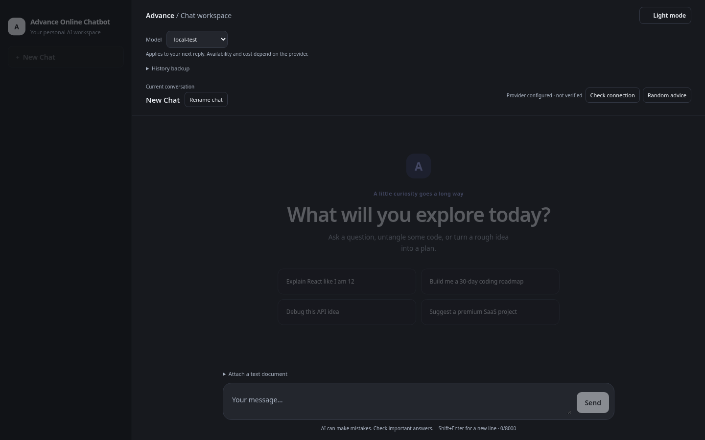
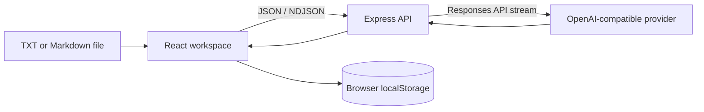

# Advance Online Chatbot

A tested full-stack AI workspace built with React, Express, and the official OpenAI SDK. The project explores reliable streaming, controlled model selection, browser-local conversation management, safe document context, and defensive API design.

[Live frontend](https://merak-max.github.io/advance-online-chatbot/) · [Source code](https://github.com/merak-max/advance-online-chatbot)



> The GitHub Pages demo hosts the frontend only. AI replies require a separately configured backend. Provider credentials belong on the server and must never be placed in frontend code, `VITE_*` variables, or committed files.

## Highlights

- Multiple browser-local conversations with search, rename, delete, retry, and additive backup import/export.
- Incrementally streamed AI replies with user cancellation and honest preservation of interrupted partial text.
- Server-controlled model allowlist with remembered selection and per-reply model attribution.
- Markdown and code rendering with raw HTML disabled and external images blocked.
- One validated UTF-8 `.txt` or `.md` reference document per chat with numbered context lines.
- Responsive light/dark interface with mobile navigation, keyboard focus states, and reduced-motion support.
- Bounded requests, model validation, explicit origin checks, provider timeouts, sanitized errors, and local request caps.
- Automated backend, state, streaming, security, and Playwright browser tests using an isolated simulated provider.

## Architecture



The browser owns conversation history and interface preferences. Express validates each request, protects provider credentials, applies limits, and translates provider streaming events into a small newline-delimited JSON protocol.

This release intentionally has no database or user-account system. It is a private single-user workspace, not a public multi-tenant AI service.

## Technology stack

| Area | Technology |
| --- | --- |
| Frontend | React 19, JavaScript, CSS, GSAP |
| Backend | Node.js, Express 5 |
| AI integration | OpenAI JavaScript SDK, Responses API |
| Rendering | `react-markdown` |
| Build tooling | Vite 8, npm |
| Testing | Node.js test runner, Playwright |
| Persistence | Browser `localStorage`, versioned JSON backups |

## Run locally

Requirements: Node.js 22.12+ or 24 LTS and npm.

```sh
git clone https://github.com/merak-max/advance-online-chatbot.git
cd advance-online-chatbot
npm ci
npm run dev
```

Open `http://127.0.0.1:5174/advance-online-chatbot/`.

The frontend runs on port `5174`, the backend on `8788`, and Vite forwards local `/api` requests to Express. Without provider configuration, the interface still loads and reports that AI setup is required; it never presents a fake fallback as a real model reply.

## Configure an AI provider

Copy the example file and keep the resulting `.env` private:

```sh
cp .env.example .env
```

For OpenAI, set `OPENAI_API_KEY` and a supported `OPENAI_MODEL`. Leave `OPENAI_BASE_URL` blank. A custom gateway may be used only when it supports the Responses API.

`OPENAI_ALLOWED_MODELS` is a comma-separated server-side allowlist. `OPENAI_ALLOW_KEYLESS=true` exists only for an explicitly trusted private gateway and requires `OPENAI_BASE_URL`; it must not be used to expose an unauthenticated public backend.

## Scripts

```sh
npm run dev       # run frontend and backend together
npm run client    # run Vite only
npm run server    # run Express only
npm run check     # run Node.js tests and production build
npm run test:e2e  # run Playwright browser tests
npm run preview   # build and serve the production app with Express
```

Browser tests use a simulated local provider and do not consume paid AI requests.

## Document workflow

The application accepts one non-empty UTF-8 `.txt` or `.md` file per chat, limited to 64 KB, 24,000 characters, and 1,000 lines. The complete small document is numbered and sent as untrusted context with each question until removed.

This is intentionally full-context document Q&A. It is not vector retrieval, PDF parsing, OCR, or a persistent knowledge base. Model-generated line citations can still be wrong and should be verified against the preview.

## Safety and limitations

- The backend defaults to loopback and rejects non-local API clients and unexpected browser origins.
- Request counters are in memory and reset when the server restarts; they are not a permanent spending budget.
- Conversation history and backups may contain sensitive material. Backups are JSON and are not encrypted.
- Browser-local data does not synchronize between devices and disappears if browser storage is cleared.
- Public deployment requires authentication, persistent rate limiting, usage controls, monitoring, and a dedicated security review.
- Provider availability, pricing, quotas, and model behavior are external to this repository.

See [RUNBOOK.md](RUNBOOK.md) for operational guidance, [TESTING.md](TESTING.md) for the acceptance checklist, and [LEARNING.md](LEARNING.md) for the staged implementation walkthrough.

## Project map

| File | Responsibility |
| --- | --- |
| `src/App.jsx` | Workspace state, conversations, streaming, stop, and retry |
| `src/api.js` | Browser API requests and NDJSON stream parsing |
| `src/chat-state.js` | Saved-history validation and AI-context filtering |
| `src/MessageContent.jsx` | Safe Markdown rendering and reply copying |
| `src/ModelSelector.jsx` | Server-controlled model selection |
| `src/HistoryTools.jsx`, `src/backups.js` | Validated backup export and additive import |
| `src/DocumentPanel.jsx`, `shared/document.js` | Text-document validation and numbered context |
| `server.js` | Express endpoints, limits, provider calls, and static serving |
| `shared/chat.js` | Shared message and context validation |
| `test/` | Node.js and Playwright regression coverage |
